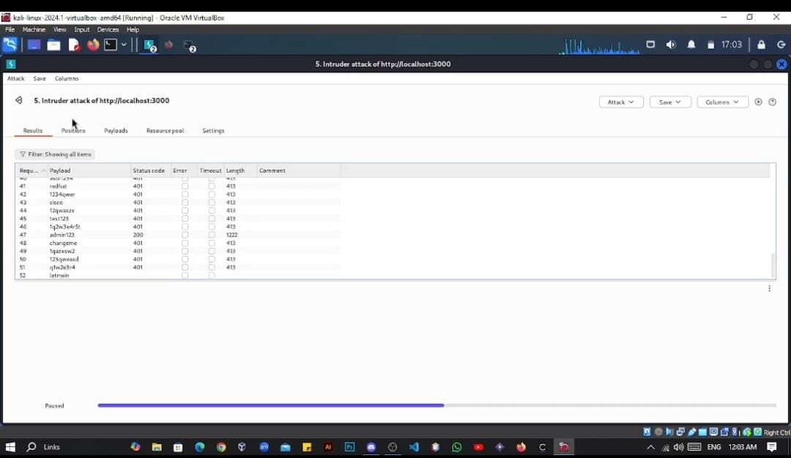

# CYS-Project
                         Web Penetration Testing Report

Executive Summary:

Purpose of the test and brief overview of key findings:
The purpose of this web penetration test was to assess the security posture of the target websites, APIs, and applications. The goal was to identify vulnerabilities, assess their potential impact, and provide actionable recommendations to enhance security.

key findings:
The assessment uncovered several critical vulnerabilities that could potentially compromise the confidentiality, integrity, and availability of the system. Key highlights include:

    Enumeration to Find Admin Path
    Brute Force on Admin Credentials
    cross-site scripting (XSS) in Product Search
    SQL injection in login page
    vulnerability show another packet

High-level impact:
Unauthorized data access, leading to potential data breaches.
Full administrative control over the application by unauthorized actors.
Theft of user credentials and potential account compromise.
Exposure of sensitive admin functionalities enabling further exploitation.
Disruption of application services and potential denial-of-service risks.
 Summary of recommendations:
           Implement robust input validation and parameterized queries.
           Sanitize user inputs and adopt Content Security Policies (CSP).
           Conduct periodic security reviews and testing.
           Enforce account lockouts and rate-limiting for login attempts.
           Secure sensitive paths like admin pages through obscurity and authentication mechanisms.

  
Scope and Methodology:
       Scope: owasp juice shop.
       Approach: Black-box.
       Tools Used: Burp Suite,FUFF,Payload for xss.

 Vulnerability Findings:
                 Enumeration to Find Admin Path.
                 Brute Force on Admin Credentials.
                 cross-site scripting (XSS) in Product Search.
                 SQL injection in login page.
                 vulnerability show another packet.
                 
 Description, risk, and potential impact (e.g., SQL injection, XSS).
 
 ## Summary:
found Authentication bybass via https://juice-shop.herokuapp.com in user login input by use bruteforce on admin credentials by burpsuite

## Steps To Reproduce:

1- visit https://juice-shop.herokuapp.com/)
2- go to profile and try to login
3-use admin email ( admin@juice-sh.op )
4-try any password 
5-open burp and bruteforce on admin credentials by top 100 passwords
6-you will find the right password go try it.

## Supporting Material/References:

https://youtu.be/EoH6FbxobS4?si=qjHdl45pOKGSBqbP

Conclusion:

Summary of security posture based on findings:
The testing revealed critical weaknesses in the web applications, highlighting the need for immediate remediation efforts. While certain areas demonstrated resilience, the identified vulnerabilities pose significant risks to operational security and data privacy.
Overall risk level: High
Next steps for remediation:
        1.Address the critical vulnerabilities outlined above on a priority basis.
        2.Conduct follow-up testing after implementing fixes.
        3.Establish a regular schedule for security assessments and updates.
Summary of Fixes for Each Vulnerability:
      1.Enumeration to Find Admin Path:
              Use obscure paths for admin functionalities.
              Require multi-factor authentication for sensitive endpoints.
              Monitor and alert on repeated failed access attempts to admin paths.
       2.Brute Force on Admin Credentials: 
              Implement account lockouts and CAPTCHA after a set number of failed login attempts.
              Enforce strong password policies and periodic password rotations.
              Use login anomaly detection to identify and block brute-force attempts.

       3. cross-site scripting (XSS) in Product Search:
              Sanitize and validate all user inputs to remove harmful scripts.
              Use a Content Security Policy (CSP) to restrict executable content.
              Employ frameworks with built-in protections against XSS vulnerabilities.
       4. SQL injection in login page:
               Utilize parameterized queries or prepared statements to handle database inputs securely.
               Validate all user inputs to ensure they conform to expected patterns.
               Minimize database user permissions and adopt a least-privilege model.

 

 

